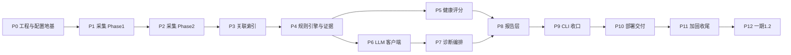

# k8s-ai 一期开发计划与排期

- 版本：v1.0
- 日期：2026-08-12
- 状态：待执行
- 关联文档：PROJECT_SPEC_一期_修订.md

## 修订记录

| 版本 | 日期 | 修订人 | 说明 |
|---|---|---|---|
| v1.0 | 2026-08-12 | Codex | 初版：基于修订版需求文档拆分 P0–P12 阶段 |

---

## 1. 阶段依赖总览

可并行项：脱敏规则库（security）可在 P1 并行开发；LLM 客户端（P6）在 P3 完成后即可启动，不依赖规则引擎。单人开发默认串行，计划按串行估算。

## 2. 里程碑

| 里程碑 | 对应阶段 | 可演示成果 |
|---|---|---|
| M1 | P0–P2 | `k8s-ai scan` 输出集群快照摘要（垂直切片跑通） |
| M2 | P3–P5 | 规则引擎发现异常并输出 Finding + Evidence + 评分 |
| M3 | P6–P7 | LLM 诊断 + 校验 + 降级可用 |
| M4 | P8–P9 | 完整 Markdown/JSON 报告 + CLI 退出码（一期 MVP） |
| M5 | P10–P11 | Docker/部署/RBAC/测试全绿，可交付 |
| M6 | P12 | Server 最小化 + 历史差异数据（Agent 记忆底座，可选） |

## 3. 总排期估算

假设单人全职、每天有效 6–7 小时，按阶段估算（含测试与文档，±30%）：

| 阶段 | 内容 | 预估（人日） | 累计 |
|---|---|---|---|
| P0 | 工程与配置地基 | 6 | 6 |
| P1 | 采集 Phase1 | 4 | 10 |
| P2 | 采集 Phase2 | 3.5 | 13.5 |
| P3 | 关联索引 | 1.5 | 15 |
| P4 | 规则引擎与证据 | 6 | 21 |
| P5 | 健康评分 + 报告层 | 3 | 24 |
| P6 | LLM 客户端 | 3 | 25 |
| P7 | 诊断编排 | 2.5 | 27.5 |
| P8 | 报告完善（LLM 诊断段/明细补全） | 1 | 28.5 |
| P9 | CLI 收口 | 1.5 | 32 |
| P10 | 部署交付 | 3 | 35 |
| P11 | 加固收尾 | 2.5 | 37.5 |
| P12 | 1.2（Server+趋势） | 4 | 41.5 |

1.1 合计约 **37.5 人日**，按 5 天/周约 **7.5–8 周**；加缓冲按 **9 周**排。1.2 另加 1 周。

## 4. 分阶段详细任务

### P0 工程与配置地基（6 人日）

目标：仓库骨架、配置系统、只读 client、CLI 骨架全部就绪，为后续所有阶段提供地基。

| # | 任务 | 产出/验收 | 预估 |
|---|---|---|---|
| P0.1 | go.mod（Go 1.24+）、目录结构、Makefile 骨架、依赖选型（cobra/viper/client-go/slog） | 仓库可 `go build` | 0.5d |
| P0.2 | `internal/model` 核心结构体：ScanOptions/ClusterSnapshot/Finding/Evidence/Diagnosis/ScanResult/Command | 结构体定义 + 字段注释 | 0.5d |
| P0.3 | `internal/config`：默认值、YAML 加载、ENV 合并、CLI 覆盖、`~` 展开、校验 | 配置优先级单测通过 | 1.5d |
| P0.4 | `internal/kubernetes` 工厂：kubeconfig/InCluster 自动判断、QPS/Burst/Timeout、`Reader` 接口与只读约束 | 连接假集群测试通过 | 1.5d |
| P0.5 | `internal/cli` 骨架：root/scan/config/version 命令注册、flag→ScanOptions 映射 | `k8s-ai version`、`config init` 可运行 | 1d |
| P0.6 | `internal/version`、`config validate` 连通性检查 | 命令可用 + 测试 | 1d |

出口标准：`go test ./...`、`go vet ./...` 绿；`k8s-ai config validate` 能连 fake 集群。

### P1 采集 Phase1（4 人日）

目标：全量轻量 list 产出 ClusterSnapshot，垂直切片能打印集群概览。

| # | 任务 | 产出/验收 | 预估 |
|---|---|---|---|
| P1.1 | Namespace/Pod/Node 列表采集（ResourceVersion="0"，分页或全量） | 快照字段填充 | 1d |
| P1.2 | Workload 列表（Deploy/RS/STS/DS/Job/CronJob） | 采集完成 | 0.5d |
| P1.3 | Storage 列表（PVC/PV/SC/VolumeAttachment） | 采集完成 | 0.5d |
| P1.4 | Network 列表（Service/EndpointSlice/Ingress/NetworkPolicy） | 采集完成 | 0.5d |
| P1.5 | Events 按 namespace 一次拉取 + involvedObject 本地索引 | 无 N+1 | 0.5d |
| P1.6 | worker pool + 单资源错误隔离 → collection_errors；系统组件探测（Discovery+Labels） | 单失败不中断；探测不假设存在 | 1d |

出口标准：`k8s-ai scan` 能输出集群资源摘要（垂直切片 M1）；请求量测试通过。

### P2 采集 Phase2（3.5 人日）

目标：只对异常对象深度采集日志、previous logs、事件与关联详情。

| # | 任务 | 产出/验收 | 预估 |
|---|---|---|---|
| P2.1 | 日志采集：TailLines、`--since`、行数/行字节/容器字节硬上限、单 Pod 超时 | 上限全部生效 | 1d |
| P2.2 | previous logs 采集 + 无 previous logs 静默跳过 | 正常降级 | 0.5d |
| P2.3 | 深度对象详情：container status/exitCode/lastState/resources/QoS/annotations 等字段抽取 | 覆盖 FR-005 | 1d |
| P2.4 | Phase2 并发（默认 4）+ 请求限流 + 总时长约束 | 压测不超限 | 1d |

出口标准：异常 Pod 能取到完整深度上下文；超限行为有测试覆盖。

### P3 关联索引（1.5 人日）

| # | 任务 | 产出/验收 | 预估 |
|---|---|---|---|
| P3.1 | ownerReferences 解析：Pod→ReplicaSet→Deployment→Node 链 | 索引正确 | 0.5d |
| P3.2 | Pod→PVC→PV→StorageClass 链 | 索引正确 | 0.5d |
| P3.3 | Service→EndpointSlice→Pod 链（含 selector 匹配判断） | 索引正确 | 0.5d |

出口标准：三类关联索引单测通过；可供规则引擎和评分复用。

### P4 规则引擎与证据（6 人日）

目标：异常发现全部收敛到规则层，产出带指纹、证据、严重级的 Finding。

| # | 任务 | 产出/验收 | 预估 |
|---|---|---|---|
| P4.1 | Rule 接口（Evaluate 返回 []Finding）+ 注册表 + enabled/disabled 配置 | 接口测试 | 0.5d |
| P4.2 | 严重级计算器：namespace/副本数/生产标签/系统命名空间/受影响服务加权 | 分级测试 | 1d |
| P4.3 | Pod 类规则：CrashLoopBackOff/OOMKilled/ImagePullBackOff/PendingPod | 表驱动测试 | 1d |
| P4.4 | Node 类规则：NotReady/DiskPressure/MemoryPressure | 表驱动测试 | 0.5d |
| P4.5 | Storage/Network 类规则：PVCPending/FailedMount/ServiceNoEndpoint | 表驱动测试 | 0.75d |
| P4.6 | Workload 类规则：DeploymentReplica/StatefulSetReplica/JobFailed | 表驱动测试 | 0.75d |
| P4.7 | Finding 指纹 + Correlated 去重标记 | 指纹稳定/去重测试 | 0.5d |
| P4.8 | Evidence 构建/排序/截断/脱敏接入（联动 security 包） | 证据链测试 | 1d |

出口标准：13+ 规则全部有测试；相关异常正确标记 correlated。

### P5 健康评分 + 报告层（3 人日，吸收原 P8 基础渲染）

| # | 任务 | 产出/验收 | 预估 |
|---|---|---|---|
| P5.1 | 罚分表（CRITICAL 30/HIGH 15/MEDIUM 5/LOW 1，可配置）+ 封顶 0 | 公式单测 | 0.5d |
| P5.2 | 扣分原因清单输出 + Correlated 排除 | 测试覆盖 | 0.5d |
| P5.3 | Markdown 渲染器（概览/评分/异常摘要/分级详情/资源汇总/组件/采集错误，渲染前二次脱敏） | golden file | 0.75d |
| P5.4 | JSON/YAML 渲染器（同一 ScanResult；latest.json 为二期 Agent 记忆契约） | 结构测试 | 0.5d |
| P5.5 | 报告写入与命名（latest.md+latest.json；daily 加时间戳；none 不落盘）+ --format/--report-mode/-n 接线 | 命名测试 | 0.75d |

### P6 LLM 客户端（3 人日）

| # | 任务 | 产出/验收 | 预估 |
|---|---|---|---|
| P6.1 | LLMClient 接口 + ChatRequest/ChatResponse/Message 模型（预留 Tools 字段） | 接口测试 | 0.5d |
| P6.2 | OpenAI Compatible HTTP 实现（httptest 全覆盖） | 200/500/429/超时/坏 JSON 测试 | 1d |
| P6.3 | 重试/退避/Retry-After/总预算控制 | 限流测试 | 0.5d |
| P6.4 | Prompt 构建 + go:embed prompts/ + 系统提示注入防护 | 契约测试（golden file） | 0.5d |
| P6.5 | api_key 与请求体脱敏保障 | 泄密测试 | 0.5d |

### P7 诊断编排（2.5 人日）

| # | 任务 | 产出/验收 | 预估 |
|---|---|---|---|
| P7.1 | DiagnosisContext 构造：证据排序 + token 预算裁剪 + top-N Finding | 预算测试 | 0.5d |
| P7.2 | LLM 输出 JSON Schema 定义与解析 | 解析测试 | 0.5d |
| P7.3 | 程序化校验：命令动词/资源/名称白名单 + Evidence ID 真实性 | 校验测试 | 0.5d |
| P7.4 | 降级策略：失败→重试→降级为规则结论，scan 不失败 | 全失败场景测试 | 1d |

### P8 报告可读性优化（已完成 2026-08-14）：终端一屏摘要、日志证据压缩、严重级图标/健康条/组件状态、--verbose（基础渲染已随 P5 落地）

| # | 任务 | 产出/验收 | 预估 |
|---|---|---|---|
| P8.1 | Markdown 渲染器（规范 §28 结构 + 扣分原因 + collection_errors） | golden file 测试 | 1d |
| P8.2 | JSON/YAML 渲染器（同一 ScanResult 序列化；latest.json 为二期 Agent 记忆契约） | 结构测试 | 0.5d |
| P8.3 | 报告命名：latest + 时间戳；daily 模式 | 命名测试 | 0.5d |
| P8.4 | 渲染前二次脱敏 | 泄密测试 | 0.5d |
| P8.5 | 控制台摘要输出（健康分、分级计数、Top 问题列表） | CLI 效果验收 | 0.5d |

### P9 CLI 收口（1.5 人日）

| # | 任务 | 产出/验收 | 预估 |
|---|---|---|---|
| P9.1 | `scan pod` 目标模式；`--namespace` 过滤语义落实（已于 2026-08-14 提前实现） | 场景测试 | 0.5d |
| P9.2 | 退出码约定 0/1/2 + `--fail-on` | 测试 | 0.5d |
| P9.3 | service 层最终编排（ScanService.Run）与 CLI/Server 解耦验证 | 架构测试 | 0.5d |

出口标准：`k8s-ai scan` 全链路可跑通（M4 = 一期 MVP）。

### P10 部署交付（3 人日）

| # | 任务 | 产出/验收 | 预估 |
|---|---|---|---|
| P10.1 | 多阶段 Dockerfile（非 root、小镜像、prompts embed） | 镜像可构建运行 | 0.5d |
| P10.2 | deploy/ RBAC：clusterrole（仅 get/list/watch + pods/log get）、sa、rolebinding | RBAC 清单测试 | 0.5d |
| P10.3 | configmap + cronjob（OnFailure/Forbid/时区/报告 PVC） | 清单可 apply | 1d |
| P10.4 | README（安装/配置/命令/安全/故障示例/开发测试） | 文档完整 | 0.5d |
| P10.5 | Makefile 完善（build/test/lint/docker/clean） | 命令可用 | 0.5d |

### P11 加固收尾（2.5 人日）

| # | 任务 | 产出/验收 | 预估 |
|---|---|---|---|
| P11.1 | 全量测试补齐 + go vet + go test -race | 全绿 | 1d |
| P11.2 | 大集群 fake 压测（1000 Pod）：请求量、内存、耗时验证 | 压测报告 | 1d |
| P11.3 | 只读/RBAC/泄密/请求量四类架构测试最终确认 + README 安全章节 | 全部通过 | 0.5d |

### P12 一期 1.2（可选，4 人日）

| # | 任务 | 产出/验收 | 预估 |
|---|---|---|---|
| P12.1 | Server 最小化：healthz/readyz/version + POST /api/v1/scans + GET /api/v1/scans/{id}（内存任务注册表，单任务并发限制） | HTTP 测试 | 2d |
| P12.2 | 历史差异数据（Agent 记忆契约）：读取上一份 JSON，按指纹对比新增/持续/恢复，为二期 scan_cluster 自动携带提供结构化上下文 | 对比测试 | 1.5d |
| P12.3 | 历史差异段落渲染（人读日报为次要产出）+ README 更新 | golden file | 0.5d |

## 5. 开工顺序建议

按 P0 → P1 → P2 → P3 → P4 → P5 → P6 → P7 → P8 → P9 → P10 → P11 串行推进，每阶段结束跑 `go test ./... && go vet ./...` 并做一次简短交付确认（M1–M5）。

两个可选并行点：
- P1 期间并行开发 `internal/security` 脱敏库；
- P3 完成后提前启动 P6 LLM 客户端。

每阶段结束时的产出都可回看本计划调整后续任务，需求变更同步更新 PROJECT_SPEC_一期_修订.md 并记录到修订记录表。
