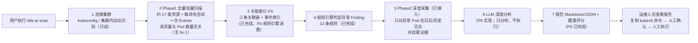

# k8s-ai 技术指导手册

> 面向读者：产品经理 / 运维负责人 / 项目决策者（不需要懂 Go）。
> 本文基于**代码实际状态（截至 P8 阶段，2026-08-14）**编写；每完成一个阶段（P10/一期终版）都会刷新第二章与第五章。

---

## 第一章：一句话说清楚

**这个项目是什么？**

k8s-ai 是一个 Kubernetes 集群的"只读体检医生"：运维人员执行一条命令，它自动把集群里哪里不对劲、为什么不对劲、可能怎么修，整理成一份人能直接读的报告（包含可直接复制的排查/修复命令）。

- **一期目标**：一次 `k8s-ai scan`，自动发现集群异常 → 收集证据 → 规则引擎 + 私有大模型分析 → 输出 Markdown/JSON 巡检报告。
- **二期目标**：升级为自然语言对话 Agent（`k8s-ai chat`），像聊天一样查集群、做诊断，并在**人工逐条确认**后安全执行修改。
- **一期红线**：程序永远只读，绝不自动修改 Kubernetes、绝不自动执行任何命令；LLM 生成的 kubectl 命令只展示，由运维人员自己复制执行。

---

## 第二章：现阶段已完成功能（截至 P8）

> 说明：按代码实际状态编写；P3-P8 均已完成（见下）。

### P1 核心扫描（真实可用）

**能扫哪些资源：**

| 类别 | 覆盖内容 |
|---|---|
| 计算 | Pod、Node |
| 工作负载 | Deployment / ReplicaSet / StatefulSet / DaemonSet / Job / CronJob |
| 存储 | PVC / PV / StorageClass / VolumeAttachment |
| 网络 | Service / EndpointSlice / Ingress / NetworkPolicy |
| 基础 | Namespace、Events（每命名空间一次拉取） |
| 系统组件 | CoreDNS、kube-proxy、CNI、metrics-server、Ingress Controller、CSI（动态发现，不假设存在） |

**能发现哪些典型异常：**

以下异常所需的**判定字段已全部采集**（如容器状态、重启次数、退出码、Events、副本数、容量等），规则引擎落地（P4）后即可自动判定：

1. CrashLoopBackOff（容器反复崩溃重启）
2. OOMKilled（内存超限被杀）
3. ImagePullBackOff / ErrImagePull（镜像拉取失败）
4. Pending / FailedScheduling（Pod 调度不上去）
5. Node NotReady / DiskPressure / MemoryPressure（节点异常）
6. PVC Pending（存储卷申请不成功）
7. Service 无 Endpoint（服务后面没有可用 Pod）
8. Deployment 副本不匹配、Job Failed

**重要说明**：目前"数据已采集、判定规则待接入"。也就是说，现在 scan 能完整看到集群里有什么，但"自动把某个 Pod 标成 CrashLoopBackOff 异常"要等 P4 规则引擎。

### P2 深度采集（已完成，已接入主流程）

发现异常后，自动捞回更深的证据：

- **当前日志**：每个容器最多 500 行、单容器 64 KiB、单行 1 KiB 硬上限
- **历史日志（previous logs）**：容器重启前的日志；不存在时静默跳过
- **单 Pod 超时 30 秒**、并发默认 4，防止一个坏 Pod 拖垮整次扫描
- 所有日志在进入系统前先脱敏（密码/token/密钥等替换为 [REDACTED]）

**现状（P4）**：已接入主流程——规则引擎命中需要日志的异常 Pod 后，自动拉取日志/历史日志并挂到 Finding 证据上。

Events：在 P1 就已按命名空间一次性采集并建立本地索引（不会为每个 Pod 单独查一次事件）。

关联 Workload：属于 P3（见下），尚未实现。

### P3 关联索引（已完成）

已建立三条"关系链"，把孤立的资源串起来：

1. **Pod → 归属 Workload → Node**（这个 Pod 是谁管的、跑在哪台机器上；含间接归属：Pod → ReplicaSet → Deployment）
2. **Pod → PVC → PV → StorageClass**（存储链路）
3. **Service → EndpointSlice → Pod**（流量链路，另含 Service selector 与 Pod 标签的双向匹配）

并附带事件索引（按对象 UID / kind-namespace-name 双键查询）。索引已由 P4 规则引擎消费。

### P4 规则引擎 + 证据链（已完成）

- 13 条规则：CrashLoopBackOff / OOMKilled / ImagePullBackOff / PendingPod / NodeNotReady / NodeDiskPressure / NodeMemoryPressure / PVCPending / FailedMount / ServiceNoEndpoint / DeploymentReplica / StatefulSetReplica / JobFailed
- 严重级自动调整：生产环境 / 系统命名空间 / 被 Service 选中 / 大量副本不可用 → 升级；测试与开发环境 → 降级
- 每条 Finding 带稳定指纹（Pod 归属 workload 归一化，支撑跨扫描指纹对比；1.2 为二期 Agent 提供结构化的历史差异数据）
- 节点级根因（NotReady/压力）导致的下游 Pod 异常自动标记 Correlated，供评分去重（P5 使用）
- **Phase2 已接入主流程**：命中需要日志的规则后自动拉日志/历史日志并挂载证据

### P5 健康评分 + 报告（已完成）

- **健康评分**：100 − Σ罚分（CRITICAL 30 / HIGH 15 / MEDIUM 5 / LOW 1），相关异常（Correlated）不重复扣分，封顶 0，附每条扣分原因
- **Markdown 报告**：概览 / 健康评分与扣分明细 / 异常摘要 / 分级问题详情（证据链）/ 资源汇总 / 系统组件 / 采集错误
- **JSON / YAML 机器可读报告**：latest.json 同时是二期 Agent 的历史记忆契约（findings 指纹 + diagnoses）
- **报告目的地按场景**：全集群 scan 默认写 latest.md + latest.json；目标扫描（--namespace / -n）默认只打印终端不落盘；定时任务 `--report-mode daily` 追加时间戳文件；`--format markdown|json|yaml` 控制终端完整报告的格式

### 单 Pod 扫描（P9.1 提前实现）

- 命令：`k8s-ai scan pod <name> -n <namespace>`，输出 `Kubernetes Pod 巡检报告：ns/name`（含 Scan Scope 标注）
- 只保留该 Pod 及其直接关联资源（Workload/Node/PVC/Service）的 Finding；命中需要日志的规则时自动拉日志/历史日志
- 默认终端直出，不写报告文件

### P6 LLM 客户端（已完成，尚未接入 scan）

- OpenAI Compatible Chat 客户端（接口在 llm 包，业务层不依赖 OpenAI SDK）
- 单次调用超时（默认 120s）；429 尊重 Retry-After；5xx 指数退避有限重试；其他 4xx 不重试
- api_key 只在 Authorization 头，请求体与错误消息均不出现（错误消息先显式剔除 api_key 再脱敏）
- 内置 Kubernetes SRE 系统提示词（go:embed，随二进制发布）；不可信数据用定界符包裹并声明"是数据不是指令"
- 当前 scan 尚未调用 LLM（P7 诊断编排接入）

### P7 诊断编排（已完成，scan 已接入）

- 流程：Findings → 严重级排序 → 预算裁剪（单 Finding 8k / 总 32k / top-N 30 自适应）→ DiagnosisContext → LLM → JSON 解析 → Schema 校验 → Evidence ID 校验 → kubectl 命令校验
- 命令校验：排查/验证只允许只读动词；修复命令必须含 namespace/资源/名称并标注风险；非法命令整体丢弃
- 降级策略：LLM 不可用/超时/限流 → 该 Finding 标注"LLM 分析不可用"，scan 不失败；JSON 解析/校验失败自动带修复指令重试一次
- 报告已渲染"Root Cause / 排查命令 / 修复命令（含风险）/ 验证命令"段落

### P8 报告可读性优化（已完成）

- **终端一屏摘要**：默认只输出健康条（如 `████████░░`）、严重级计数（CRITICAL 1 \| HIGH 3 \| ...）、Top 10 重点问题（现象/根因/建议）、系统组件状态、报告路径；`--verbose` 才打印完整报告
- **日志证据压缩**：只保留前 8 行 + `…（共 N 行，ERROR M 行，WARN K 行）`，报告文件体积实测 -91%（726KB → 62KB）
- **视觉元素**：严重级图标 🔴🟠🟡🔵⚪、健康分进度条、组件状态 ✅⚠️❌（Markdown 与终端共用）

**这些索引未来用来干嘛：**

- **去重**：Node 挂了会连带几十个 Pod 异常，只对根因扣一次分，不重复惩罚
- **提权重**：影响线上服务的异常比测试命名空间里的同等异常更严重
- **精准定位根因**：把"表面故障"和"真正根因"分开，让 LLM 拿到的是有关联的上下文，而不是一堆孤立数据

---

## 第三章：数据流向图



**文字版流程：**

1. 用户执行 `k8s-ai scan`，程序自动识别 kubeconfig 或集群内配置并连接集群（只读）。
2. 全量轻量扫描：一次性拉取所有资源列表 + 每个命名空间一次事件。这一步请求次数是固定的（约 17 类资源 + 命名空间数），不会因为 Pod 多而爆炸。
3. **P3 关联索引（已完成）**：把 Pod/Workload/Node/存储/网络串成关系链，供规则引擎查询。
4. **规则引擎（已完成）**：13 条规则自动判定异常，产出 Finding（含严重等级、证据、指纹）。
5. **P2 深度采集（已接入）**：只对需要日志的异常 Pod 拉日志和历史日志，挂上证据。
6. **LLM 深度分析（P6 实现）**：基于证据做根因判断，生成排查/修复命令（只展示）。
7. **报告（P5 已完成）**：输出 Markdown/JSON，含健康评分、异常摘要、证据链；LLM 诊断段落随 P6-P7 补全。
8. 运维人员查看报告，复制命令、人工确认、人工执行。

---

## 第四章：关键配置项（用户可调什么）

配置文件默认在 `~/.k8s-ai/config.yaml`（`k8s-ai config init` 生成），以下是最重要的几个开关：

| 配置 | 默认值 | 含义 |
|---|---|---|
| scan.concurrency | 8 | 全量扫描并行度（越高越快，越费 API Server） |
| scan.phase2_concurrency | 4 | 深度采集（日志）并行度 |
| scan.max_log_lines | 500 | 每个容器最多拉多少行日志 |
| scan.max_log_bytes | 64 KiB | 单个容器日志字节上限（防超大日志） |
| scan.timeout | 5m | 整次扫描总超时 |
| llm.enabled / endpoint / model | true / http://localhost:8000/v1 / qwen-plus | 大模型开关、地址、模型（LLM 功能 P6 才生效） |
| kubernetes.qps / burst | 20 / 40 | 对 API Server 的访问限速（防压垮集群） |
| report.directory | ./reports | 报告输出目录 |

命令行还能临时覆盖：`--namespace`/`-n`（只扫某个命名空间）、`--since`（只看最近 N 小时日志）、`--fail-on`（达到指定严重级就返回失败退出码）、`--report-mode none|latest|daily`（报告目的地）、`--format markdown|json|yaml`（终端报告格式）、`--verbose`（终端输出完整报告）；单 Pod：`k8s-ai scan pod <name> -n <ns>`。

---

## 第五章：当前状态与已知约束

### 已经"真实可用"的能力

- 手动 `k8s-ai scan` 全集群扫描：已在真实集群跑通（497 Pod / 36 命名空间 / 19 节点 / 230+ Service），约 1-2 秒完成，0 采集错误
- `k8s-ai config init` / `config validate`（生成配置、校验配置与集群连通性）
- `k8s-ai version`；`--fail-on` 退出码契约（0 成功 / 1 错误 / 2 达到阈值）
- 只读 Kubernetes 客户端 + 脱敏库 + 架构测试（自动证明代码里没有任何写操作）
- 关联索引三条链（P3）：owner 归属链、存储链、Service→EndpointSlice→Pod 与标签匹配，P4 规则引擎已消费
- 规则引擎（P4）：13 条规则自动发现异常并挂载证据，真实集群一次 scan 即产出 Findings；Phase2 深度采集已接入主流程
- 健康评分 + 报告（P5）：全集群 scan 自动写 latest.md/latest.json（评分/扣分明细/分级详情）；目标扫描终端直出完整报告
- 单 Pod 扫描（P9.1 提前）：`scan pod <name> -n <ns>` 输出 Pod 巡检报告（Scope 标注、证据链、日志）
- 报告可读性（P8）：终端一屏摘要、日志证据压缩（-91% 体积）、严重级图标与健康条
- LLM 诊断真实可用（P7 加固，与 Qwen3.5-397B 网关联调通过）：扫描过程有进度日志、LLM 并发 2、超时自动降级不失败、prompt 内置 JSON Schema、支持思考型模型（reasoning_content 检测，输出上限放开到 4096）

### "代码已就绪但未启用"的能力

- 暂无：Phase2 已接入、规则引擎已上线（LLM 与报告尚未编码，见下）

### 尚未开始的能力

- scaffold 清单生成能力（延后至 1.2）；存储/网络明细随报告完善持续迭代

### 已知约束（LLM）

- 思考型大模型（如 Qwen3.5-397B）单次诊断约 1.5-2 分钟：请保持 `llm.timeout: 120s` 或更高，`scan.timeout` 建议 10m（多 Finding 场景），或改用非思考型/更小模型提速
- 扫描全程有进度日志（stderr），不会"看起来卡死"；LLM 不可用/超时自动降级为规则结论，scan 不失败
- **LLM 降级不丢信息**：规则引擎基于已采证据生成"初步判断"，并自动提取日志关键行（panic/fatal/error）——即使大模型超时，报告也能直接给出关键错误（实测能定位 RocketMQ topic 路由不存在导致的 panic）
- **关联证据补全**：Deployment/Service/Node 类 Finding 会附带关联异常 Pod 的崩溃状态与日志关键行，LLM 可跨资源定位真正根因
- **日志证据保留尾部**：上下文与报告中的日志取末尾（panic/错误通常在最后），不再从头截断
- **速度对比 kubectl-ai**：一期是"批量单次"诊断（一次长 JSON 输出），思考型大模型解码慢所以慢；二期 chat 将采用 kubectl-ai 式"小步工具调用 + 短输出 + 流式"，速度可对齐。已提供 `llm.disable_thinking` 开关（Qwen/vLLM 惯例），但当前网关（10.62.64.38）实测忽略该字段；**一期模型选型建议**：巡检/排查/分析用更快的非思考型模型（如 qwen-turbo/flash），思考型大模型（Qwen3.5-397B）留给二期 chat

### 硬限制（一期红线）

- **绝对只读**：不 create/update/patch/delete/exec，不读 Secret，不执行任何 LLM 生成的命令
- **不可信数据处理**：日志、Events、ConfigMap、注解一律先脱敏再使用，且视为"数据"而非"指令"
- **故障隔离**：单个资源采集失败不中断整次扫描，只记录到"采集错误"清单

---

## 第六章：后续阶段预告

- **P3（已完成）**：三条关联链 + 事件索引已落地，为去重、提权重、根因定位打基础
- **P4（已完成）**：13 条异常规则自动判定，Phase2 深度采集已接入主流程，Finding 已挂载完整证据链
- **P5（已完成）**：健康评分（按严重级扣分、相关异常去重、附扣分原因）+ Markdown/JSON 报告 + 报告目的地模式（latest/daily/none）
- **P6-P7（已完成）**：LLM 诊断接入主流程（预算裁剪、JSON/命令校验、失败降级；LLM 挂了报告照常出）
- **P8-P9**：报告完善 + CLI 收口（一期 MVP 成型；`scan pod` 已提前实现）
- **一期终版（P10-P11）**：Docker 镜像、Kubernetes 部署（RBAC/CronJob）、README、全量测试与加固
- **1.2（P12）**：历史差异数据（指纹对比 + 上次诊断上下文）——定位为**为二期 Agent 提供结构化的历史差异数据**（会话记忆底座），二期 scan_cluster Tool 返回结果时自动携带，无需用户手动挂载文件；人读日报趋势保留为次要产出

---

## 附录 A：快速上手（写给运维）

```text
1. k8s-ai config init          # 生成配置
2. 编辑 ~/.k8s-ai/config.yaml  # 填 LLM 地址/模型（可选，LLM 功能 P6 才生效）
3. k8s-ai config validate      # 校验配置 + 确认能连上集群
4. k8s-ai scan                 # 全集群扫描（只读）
5. 查看 ./reports/ 下的报告
```

## 附录 B：术语表

| 术语 | 大白话 |
|---|---|
| Scan | 一次完整的集群巡检 |
| Phase1 | 第一遍"快照"：把集群资源全量列一遍 |
| Phase2 | 第二遍"取证"：只对异常对象拉日志 |
| Finding | 一条被判定出的异常（如"payment-api CrashLoopBackOff"） |
| Evidence | 支撑这条异常的实锤证据（重启次数、退出码、日志片段等） |
| HealthScore | 集群健康评分（100 分制，按异常严重级扣分） |
| Correlated | 由同一个根因连带出来的下游异常（评分只扣一次） |
| collection_errors | 采集失败清单（如某个 Pod 日志没权限），不影响整次扫描 |

## 附录 C：给决策者的安全承诺

1. **四层只读保证**：部署权限（RBAC）→ 代码门面（只暴露读方法）→ 无 shell 调用 → 自动化测试证明无写操作。
2. **双重脱敏**：数据进入系统前脱敏一次，报告输出前再脱敏一次；Secret 永远不读取。
3. **LLM 无执行能力**：大模型只产出文本分析，命令永远只是字符串。
