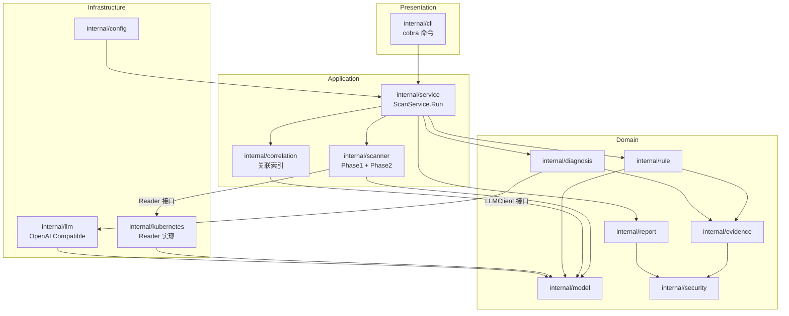

# k8s-ai 一期总体架构设计

- 版本：v1.0
- 日期：2026-08-12
- 状态：待评审
- 依据：PROJECT_SPEC_一期_修订.md（v1.0）、AGENTS.md、DEVELOPMENT_PLAN_一期.md（v1.0）

## 1. 目的与范围

本文档将评审通过的一期需求转化为可直接指导编码的技术架构。范围覆盖 1.1（MVP）；1.2（Server、趋势对比）只定义扩展边界，不进入本期实现。

## 2. 架构原则

1. **业务逻辑不依赖 CLI**（AGENTS.md）：CLI/Server/CronJob 复用同一个 `service.ScanService`。
2. **一期严格只读**：RBAC 只读动词 + 代码层只读门面 + 无 shell/exec + 架构测试证明。
3. **两阶段扫描**：Phase1 全量轻量 list，Phase2 只对异常对象深度采集（日志）。
4. **异常发现收敛到 Rule Engine**：Scanner 只采集，不判断；避免两套判断逻辑。
5. **小接口、消费方定义接口**：包之间通过最小接口协作，实现方返回具体类型。
6. **无循环依赖**：依赖方向单向，由 `model` 作为纯领域根。
7. **依赖最小化**：cobra / viper / client-go / slog，不引入无必要依赖。

## 3. 四层架构与模块映射

| 层 | 职责 | 包 |
|---|---|---|
| Presentation | 参数解析、命令注册、结果展示 | `cmd/k8s-ai`、`internal/cli` |
| Application | 用例编排、事务边界、预算与降级策略 | `internal/service`、`internal/scanner`、`internal/correlation` |
| Domain | 纯业务模型与规则，无 I/O | `internal/model`、`internal/rule`、`internal/evidence`、`internal/diagnosis`、`internal/security`（纯文本）、`internal/report`（评分与渲染编排） |
| Infrastructure | 外部世界适配：Kubernetes API、LLM HTTP、文件、配置、HTTP Server | `internal/kubernetes`、`internal/llm`、`internal/config`、`internal/server`（1.2）、`internal/version` |

说明：
- Domain 不 import Infrastructure；Application 通过 Domain 定义的端口（接口）调用 Infrastructure 实现。
- `internal/report` 同时承担"评分计算（纯逻辑）"与"渲染编排"，渲染器实现可视为 Domain 内部实现，不引入外部依赖。
- 目录保持扁平模块划分（与开发计划一致），依赖方向由规则约束并由架构测试守护。

## 4. 模块职责

| 模块 | 职责 | 依赖 | 被依赖 |
|---|---|---|---|
| model | 领域模型、枚举、指纹、严重级常量、ScanOptions、Budget | 仅标准库 | 全部 |
| config | 默认值/YAML/ENV/CLI 合并、`~` 展开、init/validate | model（可选） | cli、service、kubernetes |
| kubernetes | 客户端工厂（kubeconfig/InCluster）、Reader 实现、QPS/Burst/超时、只读约束 | model、client-go | scanner、service（工厂）、cli（validate） |
| scanner | Phase1 全量采集、Phase2 深度采集、worker pool、错误隔离、系统组件探测 | model、kubernetes.Reader（消费方接口） | service |
| correlation | 关联索引构建（owner/PVC/Service） | model | service、rule、diagnosis |
| rule | 规则注册表、Evaluate、严重级计算、Finding 组装 | model、evidence | service |
| evidence | 证据构建、排序、截断、ID 分配、指纹输入 | model、security | rule、diagnosis、service |
| security | 脱敏规则、敏感键识别（纯文本） | 仅标准库 | evidence、scanner、report |
| diagnosis | DiagnosisContext 构造、预算裁剪、LLM 编排、输出校验、降级 | model、evidence、llm（接口） | service |
| llm | LLMClient 接口 + OpenAI Compatible 实现、重试/429、prompt 文件（embed） | model、stdlib | diagnosis |
| report | 健康评分、Markdown/JSON/YAML 渲染、报告命名与写入 | model、security | service、cli |
| service | ScanService.Run 编排：扫描→关联→规则→深度采集→诊断→评分→报告 | 上述全部（组合根） | cli、server |
| cli | cobra 命令、flag→ScanOptions、控制台输出、退出码 | model、service、config、version | 无（入口） |
| server | 1.2：HTTP 路由、内存任务注册表 | model、service、config | 无 |
| version | 版本信息（ldflags 注入） | 无 | cli |

## 5. 依赖规则（架构测试守护）

允许的依赖方向：

```text
cli → service → {scanner, correlation, rule, evidence, diagnosis, report} → model
service → {kubernetes(工厂), config, llm(接口)}
scanner → kubernetes.Reader（消费方接口，scanner 定义）
diagnosis → llm.LLMClient（接口在 llm 包）
evidence → security
report → security
```

禁止的依赖（架构测试断言）：

```text
任何包 → cli
service/scanner/... → kubernetes 具体实现（除 service 组合根使用工厂创建）
model → 任何内部包
cli → scanner/kubernetes/llm/diagnosis/report（只能经 service）
kubernetes → rule/evidence/diagnosis/llm/report/cli
```

禁止的 import / 调用（架构测试断言）：

```text
os/exec（生产代码）
k8s.io/client-go/kubernetes/fake（生产代码）
dynamic.Interface（一期禁止，避免任意动词）
client-go 的 Create/Update/Patch/Delete/Apply/Scale/Exec 方法调用
secrets 资源访问
```

## 6. 总体架构图



## 7. 数据流图

```mermaid
flowchart LR
    A["CLI 解析<br/>flags+config → ScanOptions"] --> B["ScanService.Run"]
    B --> C["scanner.Phase1<br/>全量 list"]
    C --> D["ClusterSnapshot"]
    D --> E["correlation.Build<br/>关联索引"]
    E --> F["rule.Engine<br/>[]Finding + Evidence"]
    F --> G["scanner.Phase2<br/>仅异常对象取日志"]
    G --> H["证据补全/排序/脱敏"]
    H --> I["diagnosis.Diagnose<br/>预算内调用 LLM"]
    I --> J["[]Diagnosis<br/>校验+降级"]
    J --> K["report<br/>健康评分 + 渲染"]
    K --> L["ScanResult<br/>Markdown/JSON + 退出码"]
```



## 8. 目录结构（P0 落地目标）

```text
cmd/k8s-ai/main.go
internal/
  model/
  config/
  kubernetes/
  scanner/
  correlation/
  rule/
  evidence/
  security/
  diagnosis/
  llm/
  report/
  service/
  server/          # 1.2 占位（本期不实现业务）
  cli/
  version/
prompts/
configs/
deploy/
tests/arch/        # 架构测试（只读/RBAC/依赖方向/泄密/请求量）
Dockerfile
Makefile
go.mod
README.md
```

## 9. 关键架构决策（详见 ADR.md）

| 决策 | ADR |
|---|---|
| 两阶段扫描，Phase1 无 N+1 | ADR-001 |
| Scanner 不产 Finding，异常收敛到规则 | ADR-002 |
| Finding 指纹含 owner 归一化，支撑 1.2 趋势 | ADR-003 |
| 严重级与评分仅由规则计算 | ADR-004 |
| LLM 输出必须程序化校验并支持降级 | ADR-005 |
| 脱敏在采集边界 + 渲染两次执行 | ADR-006 |
| 单一 ScanService 供 CLI/Server/CronJob 复用 | ADR-007 |
| 删除应用内 schedule 配置，调度归 CronJob | ADR-008 |
| Phase1 只用 list，不用 watch/informer | ADR-009 |
| Events 按 namespace 一次 list + 本地索引 | ADR-010 |

## 10. 1.2 扩展边界

本期只预留接口，不实现：

- `internal/server`：定义路由与任务注册表接口，1.2 用同一个 `ScanService.Run`。
- `llm.ChatRequest.Tools` 字段：二期 Tool Calling 复用同一消息模型。
- `kubernetes.Reader` 的 Get* 方法：二期 Tool（get_pod/get_logs/...）直接包装，无需重写。
- `CommandExecutor` 接口：只声明不实现（规范 §26）。
- Finding.ID / JSON 报告：1.2 趋势对比的数据基础，本期必须稳定。

禁止提前实现：Agent Loop、Session、Approval、MCP、执行器。
