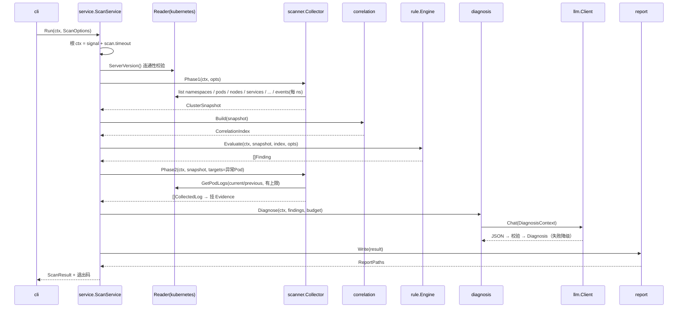
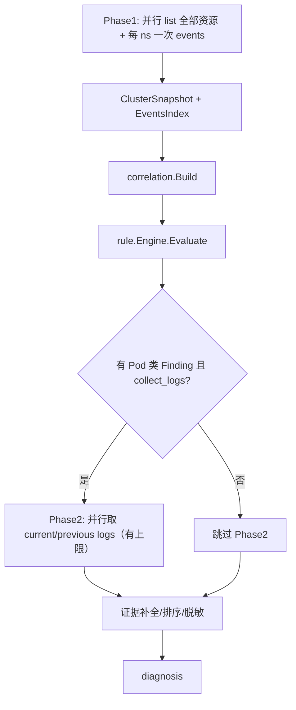
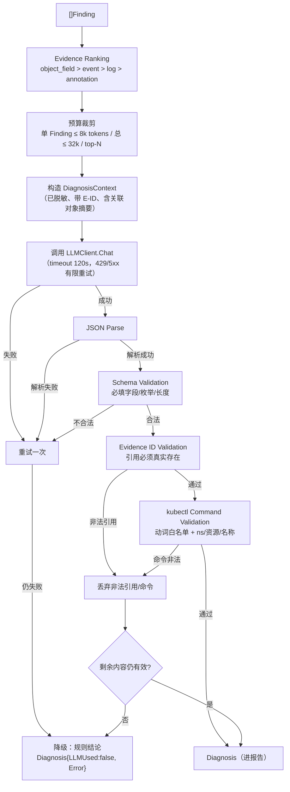

# k8s-ai 一期扫描流程设计

- 版本：v1.0
- 日期：2026-08-12
- 状态：待评审

## 1. 一次 `k8s-ai scan` 的完整执行流程



## 2. Phase1 / Phase2 边界

| 维度 | Phase1 | Phase2 |
|---|---|---|
| 目的 | 全量快照 + 异常筛选 | 异常对象深度证据（日志） |
| 请求类型 | 只 list | 只 get logs |
| 触发 | 每次 scan 必执行 | 规则产出 Pod 类 Finding 后执行 |
| 并发 | 默认 8 | 默认 4 |
| 数据 | 状态/条件/事件（本地索引） | current + previous logs |
| 失败影响 | 记 collection_errors，继续 | 记 collection_errors，继续 |
| 预算 | scan.timeout 全局 | min(剩余 scan.timeout, Phase2 上限) |

Phase2 判定标准：规则产出的 Finding 中，`Resource.Kind == Pod` 且规则声明 `NeedsLogs=true`（如 CrashLoopBackOff/OOMKilled/ImagePullBackOff）；Node/Storage/Network/Workload 类 Finding 数据已在 Phase1 齐备，不取日志。



## 3. Phase1 各资源 list 策略（无 N+1 论证）

约定：`namespace=""` 表示一次全集群 list；分页 `Limit=500 + Continue`，走 apiserver 缓存（`ResourceVersion="0"`）。

| 资源 | API 组 | Scope | 请求数 | 备注 |
|---|---|---|---|---|
| Namespaces | core | 全集群 | 1 | 最先执行，决定事件采集范围 |
| Pods | core | 全集群（或指定 ns） | 1（+分页） | 带精简字段归一化 |
| Nodes | core | 全集群 | 1 | |
| Services | core | 全集群（或指定 ns） | 1 | |
| EndpointSlices | discovery.k8s.io | 全集群（或指定 ns） | 1 | |
| Deployments/RS/STS/DS | apps | 全集群（或指定 ns） | 各 1 | 4 类 |
| Jobs/CronJobs | batch | 全集群（或指定 ns） | 各 1 | 2 类 |
| PVC / PV / SC / VolumeAttachment | core/storage | 全集群（或按 ns） | 各 1 | 4 类 |
| Ingress / NetworkPolicy | networking.k8s.io | 全集群（或指定 ns） | 各 1 | 2 类 |
| ConfigMaps | core | **不采集** | 0 | 默认不读；仅在明确相关时定向 get + 脱敏（FR-018） |
| Events | core | **每 namespace 1 次** | N | 并发受限；本地建索引 |
| Metrics | metrics.k8s.io | 不采集（1.2） | 0 | |

请求数推导：

```text
全集群模式：Phase1 请求 ≈ 1 + 16 + N_namespaces（+ 分页附加页）
指定 namespace：Phase1 请求 ≈ 1 + 16（events 1 次）
与 Pod 数量无关 → 无 N+1
```

示例：1000 Pod、50 namespace → Phase1 ≈ 67 次 list（未分页时），而非 1000+ 次。

## 4. Events 采集与本地索引

```text
ListEvents(namespace) × N_namespaces（并发 ≤ scan.concurrency）
→ 每条 Event 按 involvedObject.UID 放入 EventsIndex
→ 规则/证据按 ResourceRef.UID 查询 O(1)
```

- 只采核心组 `corev1.Event`（含 count/firstTimestamp/lastTimestamp，ADR-011）。
- 事件消息进入索引前脱敏（ADR-006）。
- 内存控制：按 namespace 丢弃超过阈值（如单 ns 5000 条）的旧事件，只保留最近 + Warning 优先。

## 5. Phase2 深度采集清单

对每个异常 Pod 的每个异常容器：

```text
GetPodLogs(current, TailLines=500, 字节上限 64KiB, 单行 1KiB)
GetPodLogs(previous, 同上)   // 无 previous 时静默跳过
```

深度字段（restartCount/lastState/exitCode/resources/QoS/annotations 等）已包含在 Phase1 的 Pod 对象中，**不需要额外请求**。

## 6. 预算与提前终止

- 总预算：根 ctx = `scan.timeout`（默认 5m）。
- Phase2 截止：`min(scan.timeout 剩余, 配置的 phase2_timeout)`；超时后未采集的日志记 `collection_errors{operation: get_logs_skipped_timeout}`。
- LLM 预算：见 CONCURRENCY.md §5。
- 取消语义：ctx 取消后，所有在途请求立即中止；已产出的快照/Findings 保留，报告标注"扫描被中断"。

## 7. CollectionErrors 语义

| 场景 | Operation | 处理 |
|---|---|---|
| list 某资源失败 | list_xxx | 该资源类型整体记错，其余继续 |
| events 某 ns 失败 | list_events | 该 ns 无事件索引，其余继续 |
| 日志权限拒绝 | get_logs | 记错，证据缺失，仍生成 Finding |
| previous logs 不存在 | get_previous_logs | 静默跳过，不记错 |
| Phase2 超时跳过 | get_logs_skipped_timeout | 记错 |
| LLM 不可用 | llm | 走 Diagnosis.Error，不进 collection_errors |

## 8. LLM 诊断流程


