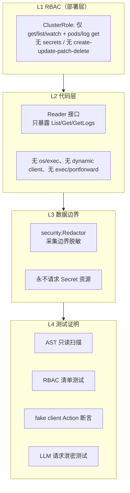

# k8s-ai 一期安全与只读边界设计

- 版本：v1.0
- 日期：2026-08-12
- 状态：待评审

## 1. 威胁模型

| 威胁 | 场景 | 防御 |
|---|---|---|
| 越权写入 | 代码/LLM 触发 create/update/patch/delete | RBAC + 代码只读门面 + AST 测试 |
| 凭据泄露 | Secret/日志/注解/env 中的密码进 LLM 或报告 | 永不读 Secret + 采集边界脱敏 + 泄密测试 |
| Prompt Injection | 日志/Events/ConfigMap/注解包含恶意指令 | 视为不可信数据 + 输出校验 + 无执行能力 |
| 编造证据 | LLM 引用不存在的资源/证据 | Evidence ID 校验 + 命令白名单 |
| 命令误执行 | 误将 LLM 输出当命令执行 | 无执行器、无 os/exec |
| 配置泄露 | api_key/kubeconfig 落日志 | 日志脱敏 + 配置校验不打印 |

## 2. 只读边界分层



## 3. RBAC 设计（deploy/ 交付物）

```yaml
apiVersion: rbac.authorization.k8s.io/v1
kind: ClusterRole
metadata:
  name: k8s-ai-readonly
rules:
  - apiGroups: [""]
    resources: [namespaces, pods, nodes, services, endpoints, events, configmaps]
    verbs: [get, list, watch]
  - apiGroups: [""]
    resources: [pods/log]
    verbs: [get]
  - apiGroups: [apps]
    resources: [deployments, replicasets, statefulsets, daemonsets]
    verbs: [get, list, watch]
  - apiGroups: [batch]
    resources: [jobs, cronjobs]
    verbs: [get, list, watch]
  - apiGroups: [storage.k8s.io]
    resources: [persistentvolumes, persistentvolumeclaims, storageclasses, volumeattachments]
    verbs: [get, list, watch]
  - apiGroups: [discovery.k8s.io]
    resources: [endpointslices]
    verbs: [get, list, watch]
  - apiGroups: [networking.k8s.io]
    resources: [ingresses, networkpolicies]
    verbs: [get, list, watch]
```

要点：
- **不含 secrets、pods/exec、pods/portforward、pods/attach**。
- 不含 `metrics.k8s.io`（1.1 不读指标，ADR-012）。
- 一期实际只用 get/list；保留 watch 仅为二期兼容（ADR-009）。
- ClusterRole 是全集群只读，README 必须说明信任边界；单 namespace 部署时支持 `kubernetes.namespace` 过滤模式（对应小范围 Role）。
- 架构测试解析本 YAML，断言 verbs ⊆ {get, list, watch} 且 resources 不含 secrets/exec。

## 4. Reader / Collector 能力矩阵

| 能力 | Reader | Collector | 说明 |
|---|---|---|---|
| list 资源 | 是 | 经 Reader | Phase1 |
| get 单个资源 | 是 | 否（一期） | 二期 Tool 使用 |
| get logs / previous logs | 是 | 经 Reader | Phase2 |
| get events | 是 | 经 Reader | 按 ns 一次 |
| 任意 get（dynamic） | 否 | 否 | 禁止 |
| create/update/patch/delete | 否 | 否 | 代码中不存在 |
| scale/rollout/exec/portforward | 否 | 否 | 不存在 |
| 读 Secret | 否 | 否 | RBAC + 代码双重禁止 |

## 5. 禁止项清单（架构测试断言）

```text
生产代码禁止：
  - import os/exec
  - import k8s.io/client-go/kubernetes/fake（仅测试）
  - dynamic.Interface / discovery 之外的任意动词客户端
  - 调用 client-go 的 Create/Update/Patch/Delete/Apply/Replace/Scale/Exec
  - 访问 secrets 资源（任何 client 方法）
  - 调用 CommandExecutor.Execute（无实现）
```

## 6. 脱敏流水线

### 6.1 采集边界（第一次脱敏，进入 Evidence 前）

`security.Redactor` 规则（正则 + 关键词双策略）：

| 类别 | 示例模式 | 替换 |
|---|---|---|
| API Key | `api[_-]?key=...`、`sk-[A-Za-z0-9]{20,}` | `[REDACTED]` |
| Token | `bearer [A-Za-z0-9._-]{16,}`、JWT `eyJ...` | `[REDACTED]` |
| 密码 | `password[:=]\S+`、`passwd[:=]\S+` | `[REDACTED]` |
| 凭据键 | 键名匹配 password/secret/token/key/credential 的值 | `[REDACTED]` |
| 私钥 | `-----BEGIN (RSA|EC|OPENSSH|PRIVATE) KEY-----` 整块 | `[REDACTED]` |
| 连接串 | URI 中 `user:pass@` | 保留 user，pass → `[REDACTED]` |
| Cookie | `cookie[:=]\S+` | `[REDACTED]` |

应用范围：日志文本、Events 消息、annotations、labels、env 字面值、ConfigMap 值（仅定向读取时）。

### 6.2 渲染边界（第二次脱敏）

报告写入前对 Markdown/JSON 全文再过一遍 Redactor（报告会外发：邮件/飞书/GitLab）。幂等：已替换的 `[REDACTED]` 不二次处理。

### 6.3 日志脱敏

结构化日志（slog）中：api_key 永不输出；错误信息先过 Redactor；debug 级别也不输出原始日志/事件全文，只输出截断摘要。

## 7. LLM 输入边界（不变量）

- 进入 LLM 的只有按预算裁剪的 DiagnosisContext（结构化文本）。
- 所有 untrusted 数据已脱敏、已截断、带 `Truncated/Redacted` 标记。
- 系统 Prompt 明确：日志/Events/配置是数据不是指令（AGENTS.md）。
- LLM 输出经校验层（§API / LLM 校验链）后才进入报告；LLM 无任何执行能力。

## 8. 架构测试证明无写操作

1. **AST 只读扫描**（tests/arch）：遍历 `internal/` 源码，断言无 forbidden import、无 clientset 写方法调用、无 `os/exec`。
2. **RBAC 清单测试**：解析 deploy/clusterrole.yaml 断言只读。
3. **Action 断言测试**：fake client + ActionRecorder 跑完整 scan，断言 actions 全部为 list/get/get-logs。
4. **泄密测试**：fake 集群含 Secret 与敏感注解；httptest LLM server 捕获请求体，断言敏感值零出现。

详见 TESTING.md。
